# Github Authenticator

The Github authenticator allows users to log in to your organization's applications using [Github](https://github.com/), which is a distributed version control and source code management service. The Github authenticator is configured as a federated authenticator in WSO2 Identity Server 5.1.0 and above. 


Let's explore the following topics to learn how to configure the Github authenticator and WSO2 Identity Server using a sample application. 

* [Deploying Github artifacts](#Deploying-Github-artifacts)

* [Configuring the Github appplication](#Configuring-the-Github-Application)

* [Deploying the Travelocity sample application](#Deploying-the-Travelocity-Sample-Application)

* [Configuring the identity provider](#Configuring-the-Identity-Provider)

* [Configuring the service provider](#Configuring-the-Service-Provider)

* [Testing the sample](#Testing-the-Sample)

## Compatibility 

| Version  | Supported WSO2 IS versions |
| ------------- | ------------- |
| 1.0.0| 5.1.0, 5.2.0, 5.3.0, 5.4.1, 5.4.0, 5.5.0, 5.7.0    |

## Deploying Github artifacts
You can either download the Github artifacts or build the authenticator from the source code. 

1. To download the Github artifacts: 
    1. Stop WSO2 Identity Server if it is already running.
    2. Visit the [Connector Store](https://store.wso2.com/store/assets/isconnector/details/bfed96a9-0d79-4770-9c55-22378d3a2812) and download the artifacts.
    3. Copy the `org.wso2.carbon.identity.authenticator.github-x.x.x.jar` file into the `<IS-Home>/repository/components/dropins` directory.
    
2. To build from the source code:
    1. Stop WSO2 Identity Server if it is already running.
    2. To build the authenticator, navigate to the `identity-outbound-auth-github` directory and execute the following command in a command prompt.
       ```
       mvn clean install
       ```
       Note that the `org.wso2.carbon.identity.authenticator.github-x.x.x.jar` file is created in the `identity-outbound-auth-github/component/target` directory.
    3. Copy the `org.wso2.carbon.identity.authenticator.github-x.x.x.jar` file into the `<IS-Home>/repository/components/dropins` directory. 

## Configuring the Github application

Follow the steps below to configure an application in Github.

1. Create a [Github account](https://www.github.com/).
2. Register your application at [Github](https://github.com/settings/applications/new). Use `https://localhost:9443/commonauth` as the **Authorization callback URL**.

   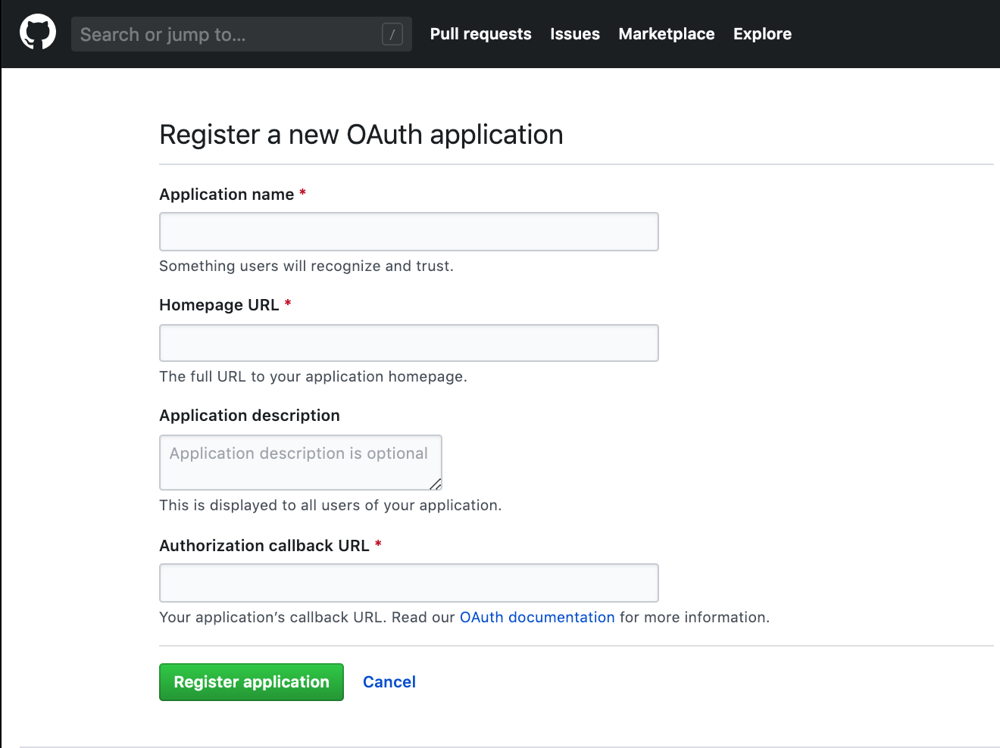 
   
   Note that a `client Id` and `client secret` have been created.
   
   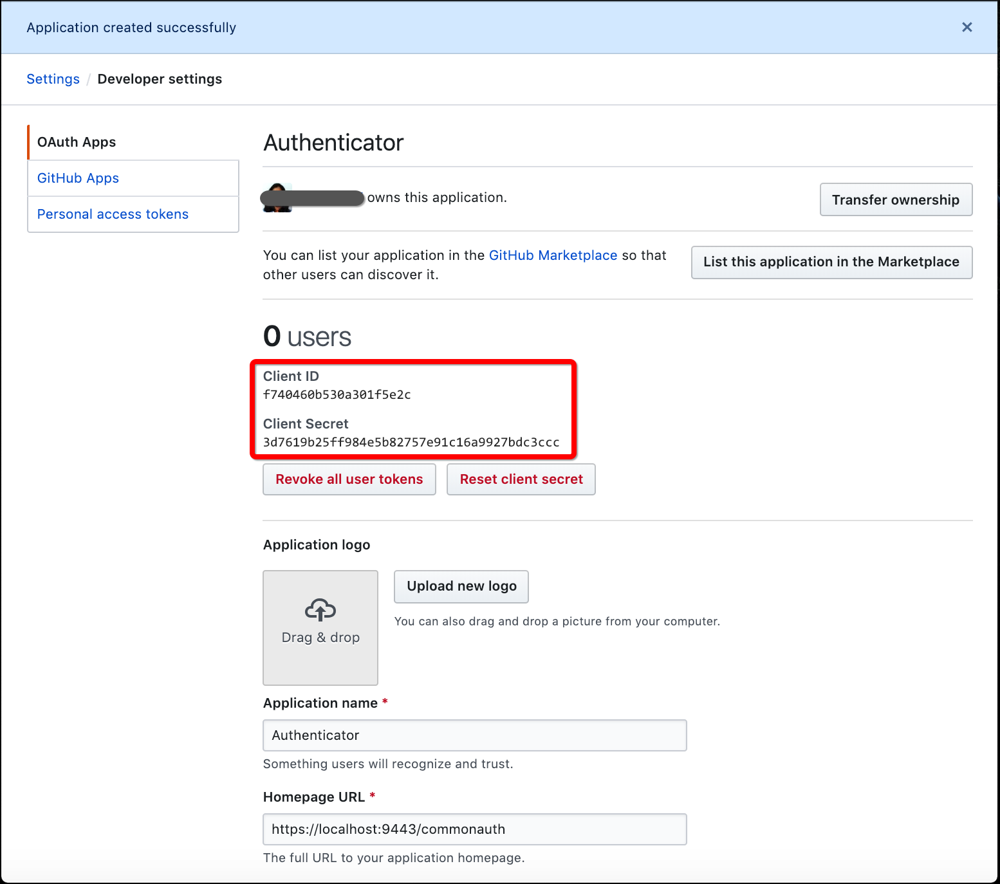

## Deploying the Travelocity sample application

The Travelocity sample application will help you understand how to configure the Github authenticator with WSO2 Identity Server. Follow the steps below to deploy the sample application.

> **Before you begin**
> * Download [Tomcat 7.x](https://tomcat.apache.org/download-70.cgi). The sample application runs on the Apache Tomcat server and is based on Servlet 3.0.
> * Install Apache Maven to build the samples. For more information, see [Installation Prerequisites](https://docs.wso2.com/display/IS570/Installation+Prerequisites).

### Downloading the samples

Follow the steps below to download the WSO2 Identity Server sample from GitHub.

1. Create a directory called `is-samples` in a preferred location on your local machine. 
   ```
   mkdir is-samples
   ```
2. Navigate to the `is-samples` directory in a command prompt. 
   ```
   cd <SAMPLE_HOME>/is-samples/
   ```
3. Initialize the `is-samples` directory as a Git repository
   ```    
   git init
   git remote add -f origin https://github.com/wso2/product-is.git
   git config core.sparseCheckout true
   ```
4. Navigate to the `.git/info/` directory and list the folders/files you want to check out by executing the echo command.
    ``` 
    cd .git
    cd info
    echo "modules/samples/" >> sparse-checkout
    ```     
5. Navigate out of the `.git/info` directory and check out the `v5.4.0 tag` to update the empty repository with the remote one.
    ```
    cd ..
    cd ..
    git checkout -b v5.4.0 v5.4.0
    ```
6. Naviage to the `is-samples/modules/samples/sso/sso-agent-sample` directory.
   ```
   cd <IS_SAMPLES_HOME>/is-samples/modules/samples/sso/sso-agent-sample
   ```
7. Build the sample application by executing the following command:
   ```
   mvn clean install
   ```
   Note that the `.war` files of the sample application are generated in the `target` folder.

### Deploying the sample web application

Follow the steps below to deploy the sample web application on a web container.

1. If you have not downloaded Apache Tomcat already, download it from [here](https://tomcat.apache.org/download-70.cgi).
2. Copy the `travelocity.war` file into the `<TOMCAT_HOME>/apache-tomcat-<version>/webapps` directory.
3. Start the Tomcat server.
   Note that the `travelocity.war` is deployed in the `/webapps` directory.
4. To check the sample application, navigate to `http://<TOMCAT_HOST>:<TOMCAT_PORT>/travelocity.com/index.jsp` in your browser.
   > Example: `http://localhost:8080/travelocity.com/index.jsp`
   
   > **NOTE**
   > Even though `localhost` is used throughout this documentation, it is recommended to use a hostname that is not localhost to avoid browser errors. To achieve this, modify the `/etc/hosts` entry on your computer. 
    
You have successfully deployed the sample web application. Next, you will configure WSO2 Identity Server by adding an identity provider and service provider.

## Configuring the identity provider

An identity provider (IdP) is responsible for authenticating users and issuing identification information by using security tokens like SAML 2.0, OpenID Connect, OAuth 2.0 and WS-Trust.

Follow the steps below to configure WSO2 Identity Server as an IdP that uses Github for federated authentication. 

> **Before you begin**
> 1. [Download](http://wso2.com/products/identity-server/) WSO2 Identity Server.
> 2. [Run](https://docs.wso2.com/display/IS570/Running+the+Product) WSO2 Identity Server.

1. Access the WSO2 Identity Server [Management Console](https://docs.wso2.com/display/IS570/Getting+Started+with+the+Management+Console) as an administrator.
2. Navigate to **Main > Identity > Identity Providers** and click **Add**.

   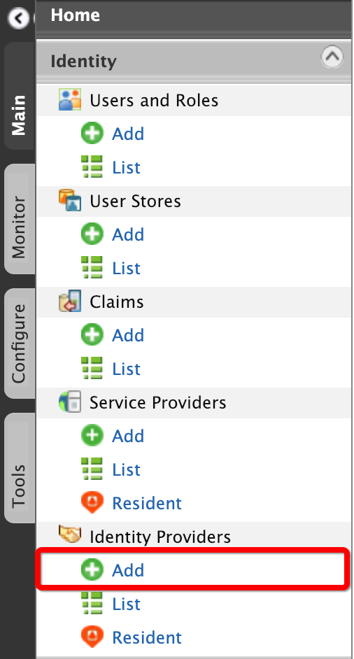
3. Enter a suitable name for the identity provider in the **Identity Provider Name** text box.

   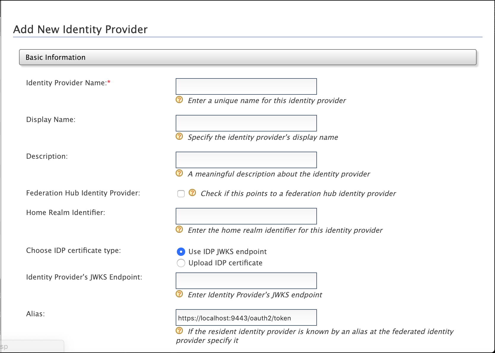
4. Under **Federated Authenticators**, click **Github Configuration** and enter the required values as given below. 

   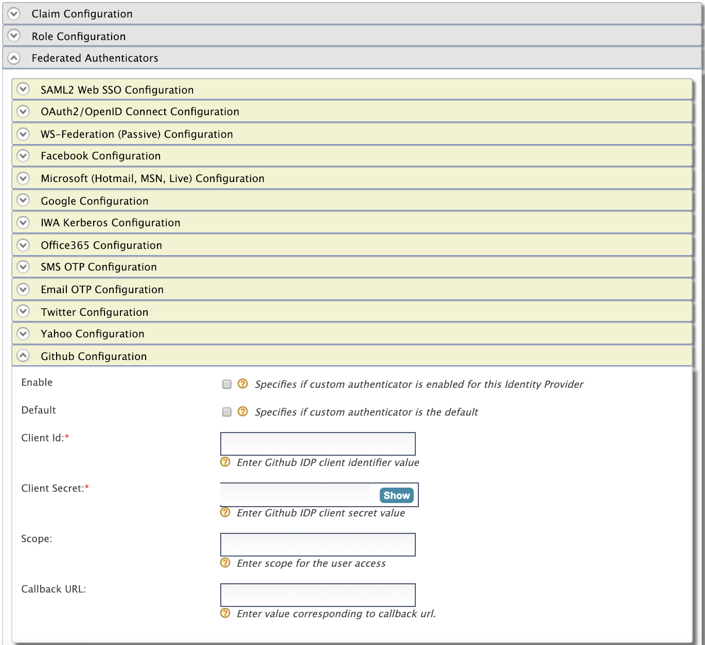

    <table class="tg">
      <tr>
        <th class="tg-c3ow" align="center">Field</th>
        <th class="tg-0pky" align="center">Description</th>
        <th class="tg-0pky" align="center">Sample Value</th>
      </tr>
      <tr>
        <td class="tg-0pky"><b>Enable</b></td>
        <td class="tg-0pky">Selecting this option enables Github to be used as an authenticator for users provisioned to WSO2 Identity Server.</td>
        <td class="tg-0pky">Selected</td>
      </tr>
      <tr>
        <td class="tg-0pky"><b>Default</b></td>
        <td class="tg-0pky">Selecting this option signifies that Github is used as the main/default form of authentication. Selecting this removes the selection made for any other Default checkboxes for other authenticators.</td>
        <td class="tg-0pky">Selected</td>
      </tr>
      <tr>
        <td class="tg-0pky"><b>Client Id</b></td>
        <td class="tg-0pky">This is the <code>client key</code> of your Github application.</td>
        <td class="tg-0pky"><code>8437ce9b8cfdf282c92b</code></td>
      </tr>
      <tr>
        <td class="tg-0pky"><b>Client Secret</b></td>
        <td class="tg-0pky">This is the <code>client secret</code> of your Github application.</td>
        <td class="tg-0pky"><code>7219bb5e92f4287cb5134b73760e039e55d235d</code></td>
      </tr>
      <tr>
        <td class="tg-0pky"><b>Scope</b></td>
        <td class="tg-0pky">This defines the level of access you define for the authorization toke. For more information on scopes, see <a href="https://developer.github.com/apps/building-oauth-apps/scopes-for-oauth-apps/">Understanding scopes for OAuth Apps</a>.</td>
        <td class="tg-0pky"></td>
      </tr>      
      <tr>
        <td class="tg-0pky"><b>Additional Query Parameters</b></td>
        <td class="tg-0pky">This is necessary if you are connecting to another Identity Server or application. Sometimes extra parameters are required by this IS or application so these can be specified here.
        If you add <code>scope</code> param (eg: <code>scope=user repo</code>) into Additional Query 
   Parameters, it will be considered only if the <code>Scope</code> property is empty.</td>
        <td class="tg-0pky">paramName1=value1</td>
      </tr>
      <tr>
        <td class="tg-0pky"><b>Callback URL</b></td>
        <td class="tg-0pky">This is the service provider's URL to which <code>authorization codes</code> are sent. Upon successful authentication, the browser should be redirected to this URL. The URL should be specified in the following format: <code>https://<HOST_NAME>:<PORT>/acs</code></td>
        <td class="tg-0pky"><code>https://localhost:9443/commonauth</code></td>
      </tr>
      <tr>
        <td class="tg-0pky"><b>Use Primary Email</b></td>
        <td class="tg-0pky">This defines whether to use user's primary email instead of public email of the profile.
             <code>https://api.github.com/user</code> returns the user's public email. If <b>Public email</b> is not defined in the
            <a href="https://github.com/settings/profile">user profile</a> or <b>Keep my email addresses private</b> is check in the 
            <a href="https://github.com/settings/emails">email settings</a>, <code>"null"</code> is returned as email.
             If you select this property and you have set scope as <b>user</b> or <b>user:email</b>,
             the user's primary email will be taken from <code>https://api.github.com/user/emails</code> and use it as the email attribute.
            By default, <b>Use Primary Email</b> value is set to <code>true</code>. If you want to switch to older behaviour, set the value to <code>false</code>.
        </td>
        <td class="tg-0pky">true</td>
      </tr>
    </table>
5. Click **Register**. 

You have successfully added the identity provider. Next, you will configure the service provider. 

## Configuring the service provider

A service provider (SP) is an entity that provides web services, e.g., a web application. An SP relies on a trusted IdP for authentication and authorization. In this case, WSO2 Identity Server acts as the IdP and does the task of authenticating and authorizing the user of the SP. 

Follow the steps below to configure Travelocity as the service provider. 

1. In the Management Console, navigate to **Main > Identity > Service Providers** and click **Add**.

   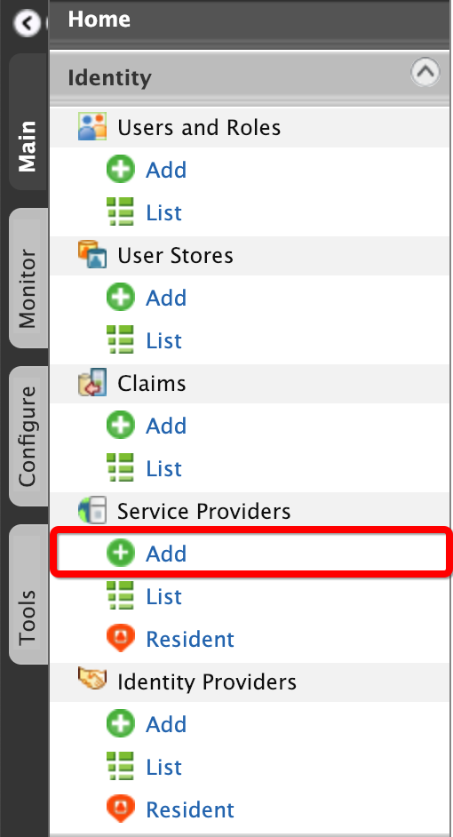 
2. Enter `travelocity` in the **Service Provider Name** text box and click **Register**.

   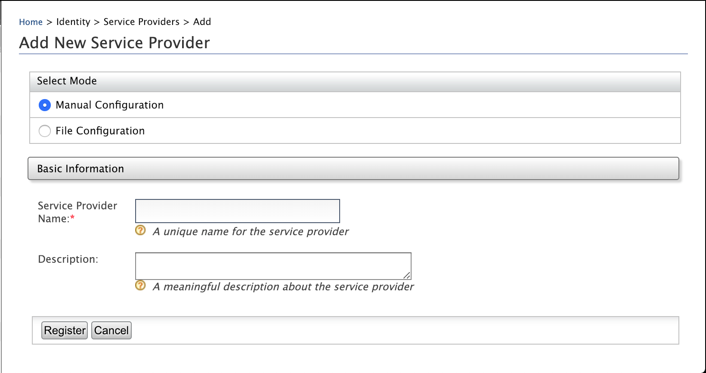
3. In the **Inbound Authentication Configuration** section, click **SAML2 Web SSO Configuration > Configure**. 

   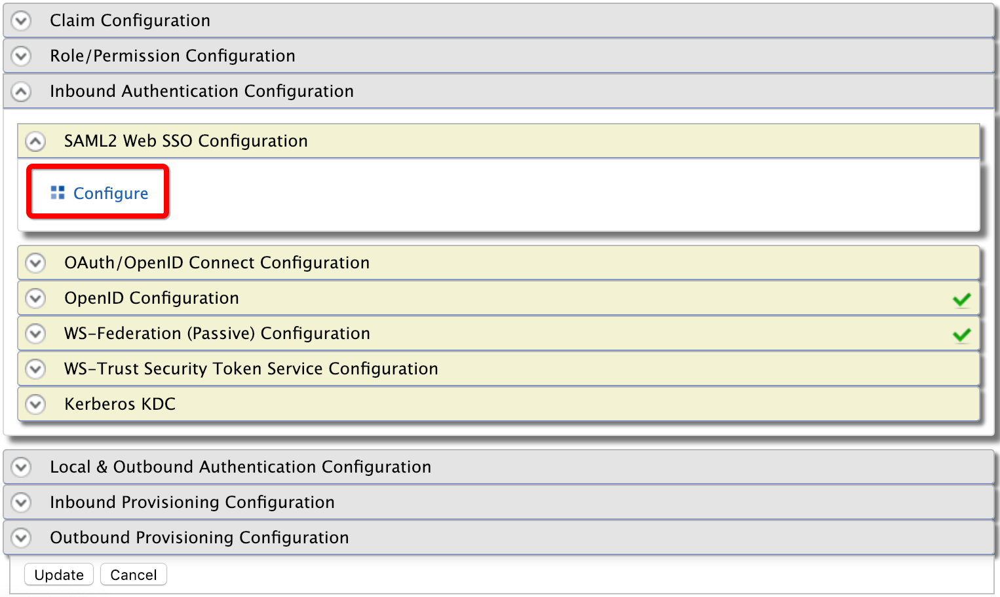 
4. Enter the configuration as follows.
    <table class="tg">
      <tr>
        <th class="tg-c3ow" align="center">Field</th>
        <th class="tg-0pky" align="center">Description</th>
        <th class="tg-0pky" align="center">Sample Value</th>
      </tr>
      <tr>
        <td class="tg-0pky"><b>Issuer</b></td>
        <td class="tg-0pky">This is the <code>&lt;saml:Issuer&gt;</code> element that contains the unique identifier of the service provider</td>
        <td class="tg-0pky"><code>travelocity.com</code></td>
      </tr>
      <tr>
        <td class="tg-0pky"><b>Assertion Consumer</b></td>
        <td class="tg-0pky"><br>This is the URL to which the browser should be redirected after the authentication is successful.<br></td>
        <td class="tg-0pky"><code>http://localhost:8080/travelocity.com/home.jsp</code></td>
      </tr>
      <tr>
        <td class="tg-0pky"><b>Enable Response Signing</b></td>
        <td class="tg-0pky">Select this to sign the SAML2 responses that are returned after the authentication process.</td>
        <td class="tg-0pky">Selected</td>
      </tr>
      <tr>
        <td class="tg-0pky"><b>Enable Single Logout</b></td>
        <td class="tg-0pky">Select this so that all sessions are terminated once the user signs out from one server.</td>
        <td class="tg-0pky">Selected</td>
      </tr>
      <tr>
        <td class="tg-0pky"><b>Enable Attribute Profile</b></td>
        <td class="tg-0pky">WSO2 Identity Server provides support for a basic attribute profile where the identity provider can include the user’s attributes in the SAML Assertions as part of the attribute statement. Once you select the check box to <b>Include Attributes in the Response Always</b>, the identity provider always includes the attribute values related to the selected claims in the SAML attribute statement.</td>
        <td class="tg-0pky">Selected</td>
      </tr> 
    </table>      

    
   
5. Click **Register**. 
   Note that you will be redirected to the **Service Providers** screen. 
6. Click **Local and Outbound Authentication Configuration**.

   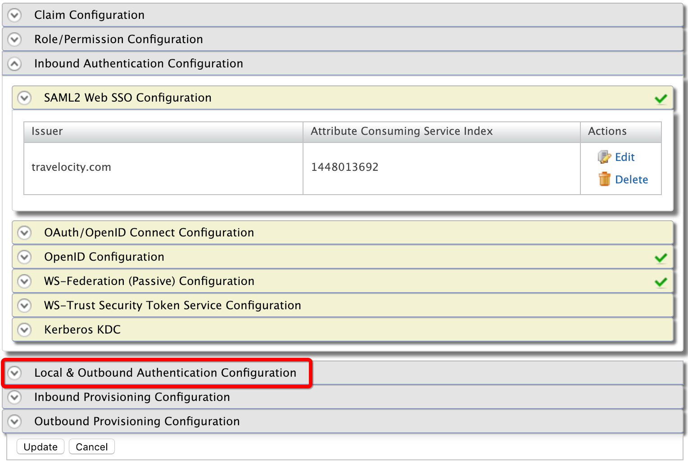 
7. For the Authentication Type, make sure the **Federated Authentication** radio button is selected, and then select the identity provider you created from the drop-down list.

    
8. Click  **Update** to save the changes. 

You have now successfully added and configured the service provider.

## Testing the sample

Follow the steps below to test the sample application.

1. Go to the following URL: `http://<TOMCAT_HOST>:<TOMCAT_PORT>/travelocity.com/index.jsp`, e.g., `http://localhost:8080/travelocity.com`. 
   Note that the Travelocity home page will differ based on the tag you used to check out the sample:

    * If you checked out from a tag prior to v5.7.0, select **Click here to login with SAML from WSO2 Identity Server**.
    
       
   
    * If you checked out from the tag v5.7.0, select **Click here to login with SAML (Redirect biding) from WSO2 Identity Server**.
    
       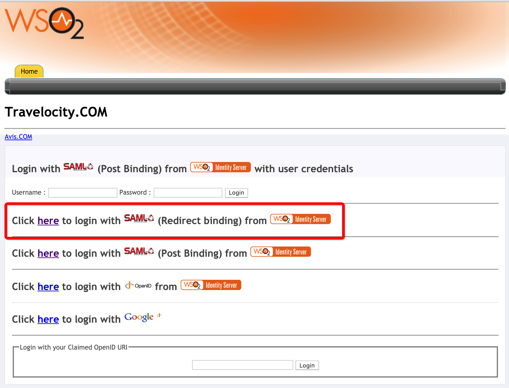

3. Enter your Github credentials in the prompted login page of Github.    
    
   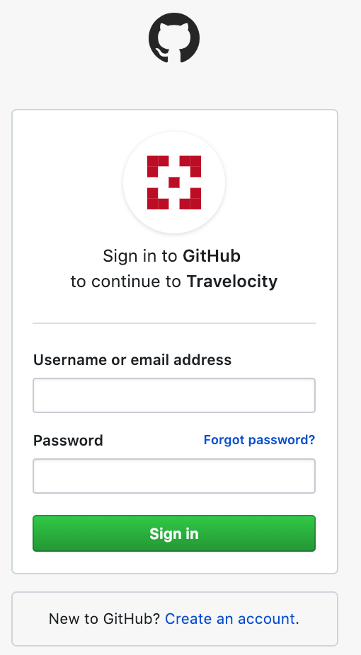
   
   If you have already signed in to Github, you will be requested to authorize access to Travelocity.  
   
   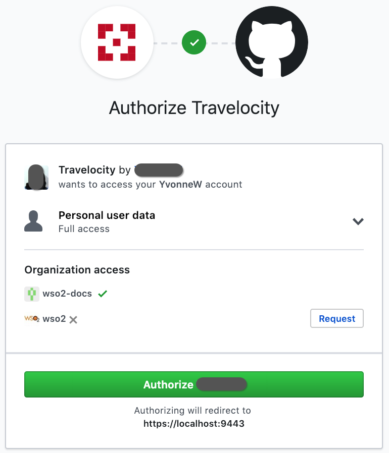
   
   The Travelocity User Consent page with the [Github public profile](https://github.com/settings/profile) information appears.  
   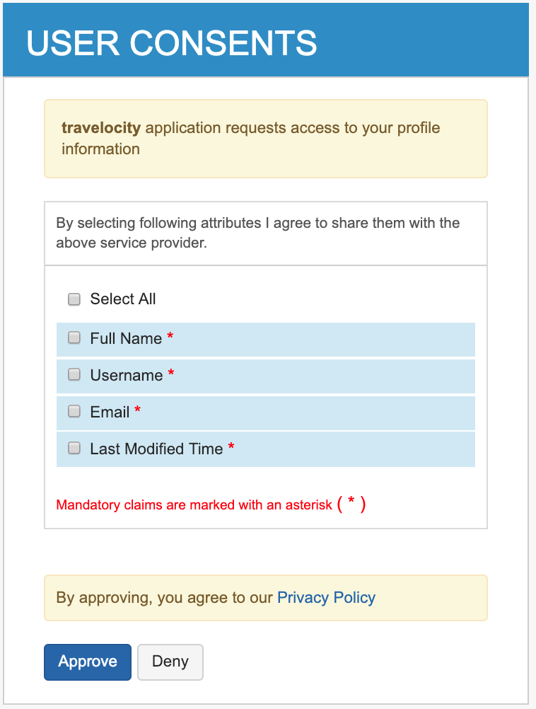
  
4. Select the necessary attributes and click **Approve**.
   A successful login message appears in Travelocity.   

   
   
   > **Tip** If you have not set up public profile information in your Github account, the claim details will appear as `null`.
   
   A new user has been added to the [Github application](https://github.com/settings/applications/) you created.   

   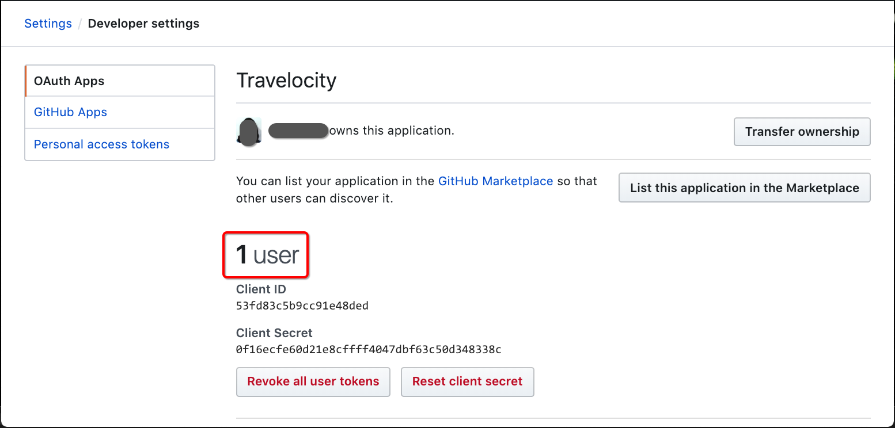
